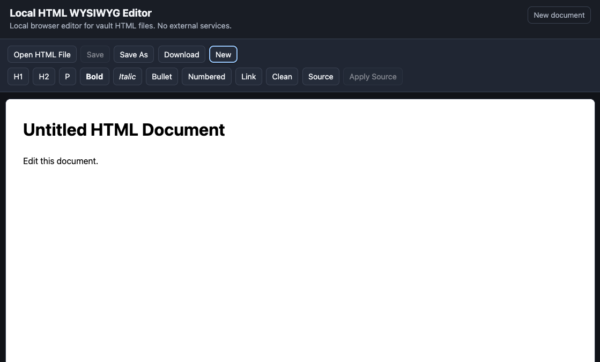
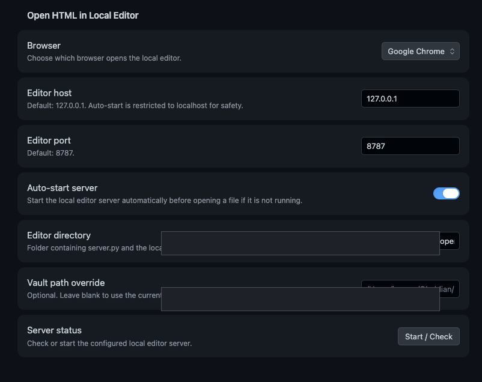

# Local HTML WYSIWYG Editor

A local WYSIWYG HTML editor with Obsidian support for opening, editing, cleaning, and saving `.html` / `.htm` companion files.

The main benefit is the Obsidian workflow: right-click an HTML file in your vault, open it in a local browser editor, make quick adjustments, updates, and corrections directly in the HTML file, then save back to the same vault file through a localhost-only server without calling the agent again.

As AI harnesses and local agents increasingly generate standalone HTML artifacts, this avoids sending every small visual or wording change back through the agent loop. It is built for people who keep HTML companion files next to notes or documents and want a lightweight adjust/clean/save workflow without a hosted editor, CDN, account, or external service.



## Features

- Obsidian helper plugin included in `obsidian-plugin/open-html-in-local-editor/`
- File-explorer right-click action for `.html` / `.htm` files in Obsidian
- Command-palette action for the active HTML file
- Auto-start support for the local editor server from Obsidian
- Settings for browser choice, host, port, editor directory, root/vault path, and auto-start
- Local browser editor served from `127.0.0.1`
- WYSIWYG editing via an iframe with browser `designMode`
- Source view with explicit apply step
- Direct local file open/save in Chromium-family browsers through the File System Access API
- Manual file input and download fallback for browsers without direct file access
- Optional vault/root-scoped server API for opening and saving files by relative path
- Basic cleanup tools:
  - remove comments
  - remove `script`, `object`, and `embed`
  - strip inline `style`, `class`, and `id`
  - unwrap `span`
  - convert `b/i` to `strong/em`

## Quick start

```bash
git clone https://github.com/busera/local-html-wysiwyg-editor.git
cd local-html-wysiwyg-editor
./start.sh
```

Open:

```text
http://127.0.0.1:8787/
```

For the smoothest open/edit/save workflow, use Google Chrome. Chrome supports direct local file open/save through the File System Access API, and it also works well with the Obsidian launcher plugin's localhost save-back flow.

## Obsidian-first workflow

The repository includes the Obsidian launcher plugin files under:

```text
obsidian-plugin/open-html-in-local-editor/
├── manifest.json
├── main.js
└── README.md
```

Install manually:

1. Copy `obsidian-plugin/open-html-in-local-editor/` into your vault's `.obsidian/plugins/` folder.
2. Enable `Open HTML in Local Editor` in Obsidian Community Plugins.
3. Open the plugin settings and set `Editor directory` to this repository folder.
4. Keep `Auto-start server` enabled unless you prefer to run `./start.sh` yourself.
5. Right-click an `.html` or `.htm` file in Obsidian and choose `Open in Local HTML WYSIWYG Editor`.
6. Edit visually in the browser, use `Clean` if needed, then `Save` to write back to the same vault file.

The plugin checks `/api/health`, starts the local server if needed, waits for readiness, then opens a URL like:

```text
http://127.0.0.1:8787/?path=relative/path/to/file.html
```

This is intentionally a launcher plugin, not a full embedded Obsidian editor. That keeps the fragile HTML editing surface in the browser while preserving the useful Obsidian integration point: selecting files directly from the vault.



## Root-scoped API mode

The server can load and save `.html` / `.htm` files below a configured root directory:

```bash
python3 server.py --host 127.0.0.1 --port 8787 --vault /path/to/your/vault-or-folder
```

Then open a file by relative path:

```text
http://127.0.0.1:8787/?path=relative/path/to/file.html
```

The server rejects:
- non-HTML suffixes
- paths outside the configured root
- non-local bind hosts
- save requests from unexpected browser origins

## Obsidian plugin files

The Obsidian plugin is part of this repository, not a separate dependency:

```text
obsidian-plugin/open-html-in-local-editor/manifest.json
obsidian-plugin/open-html-in-local-editor/main.js
obsidian-plugin/open-html-in-local-editor/README.md
```

What it provides:

- right-click action from Obsidian's file explorer for `.html` / `.htm` files
- command-palette action for the active HTML file
- command-palette action to start/check the local editor server
- configurable browser target: system default, Safari, or Google Chrome
- configurable host, port, editor directory, root/vault path, and auto-start

Auto-start is restricted to `127.0.0.1` / `localhost` for safety. If you configure another host or IP, start that server yourself.

## Browser notes

### Chrome / Arc / Brave / Edge

Best workflow, especially Google Chrome. These browsers support the File System Access API for direct open/save even without the Obsidian plugin. The Obsidian plugin can also be configured to open files directly in Google Chrome.

### Safari / Firefox

These browsers do not support direct write-back to arbitrary local files from a normal browser page. Use one of these workflows:

- Obsidian helper plugin + local server API: `Save` writes back through the local server.
- Manual mode: choose a file, edit, then download a copy and replace the original manually.

## Platform support

The browser editor and Python server are intended to work on macOS, Windows, and Linux as long as Python 3 and a modern browser are available.

Current status:

- macOS: tested. The Obsidian plugin can auto-start the server and open Google Chrome, Safari, or the system default browser.
- Windows/Linux: expected to work for the browser editor and server, but not yet tested. Start the server manually with `python server.py --host 127.0.0.1 --port 8787 --vault /path/to/vault-or-folder`, then open `http://127.0.0.1:8787/` in Google Chrome.
- Obsidian plugin on Windows/Linux: the right-click action and localhost URL flow should work when the server is already running and Browser is set to `System default`. The explicit Safari/Google Chrome launcher is currently macOS-specific because it uses `/usr/bin/open`.
- `start.sh` is a Unix/macOS convenience script. On Windows, run `python server.py ...` directly or create an equivalent PowerShell script.

## Files

```text
index.html      app shell
app.js          editor logic
styles.css      UI styling
server.py       localhost server and root-scoped file API
start.sh        convenience launcher
obsidian-plugin/open-html-in-local-editor/  Obsidian launcher plugin
```

## Verification

```bash
python3 -m py_compile server.py
node --check app.js
node --check obsidian-plugin/open-html-in-local-editor/main.js
python3 server.py --host 127.0.0.1 --port 8787 --vault .
```

Then open `http://127.0.0.1:8787/` and verify the editor loads.

## Security model

This is a local-first utility, not a web service.

- No external CDN
- No analytics
- No cloud API
- No external network dependency
- Default bind is loopback only
- Root-scoped API validates paths before reading or writing
- Obsidian plugin launches browsers with argument arrays, not shell strings

Do not expose this server to untrusted networks.

## AI assistance

This solution was primarily coded with GPT-5.5 and manually reviewed/tested before publication.

## License

MIT
